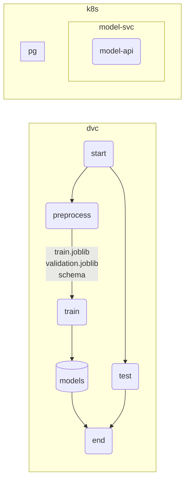

# REMLA 2022 Project

[](https://github.com/JulianBiesheuvel/remla_so/actions/workflows/release.yml)

---

# TODO clean up
# TODO clean up
# TODO clean up
# TODO clean up

---

# Overview

#TODO



# Structure

Ideally we would use [path dependencies](https://python-poetry.org/docs/dependency-specification/#path-dependencies) and have a structure like the following

```
 ├─ .github/workflows/
 |  ├─ release.yml
 |  ├─ train.yml # TODO
 ├─ lib/
 |  ├─ preprocessing + model + utils
 |  ├─ README.md
 ├─ pipeline/
 |  ├─ .dvc
 |  ├─ data/
 |  |  ├─ raw
 |  |  ├─ processed
 |  ├─ output/
 |  |  ├─ ...
 |  ├─ reports/
 |  ├─ tests/
 |  ├─ <lib package>
 |  ├─ stages.py # python -m stages <stage>
 |  ├─ pyproject.toml
 |  ├─ dvc.yml
 |  ├─ README.md
 ├─ api/
 |  ├─ <lib package>
 |  ├─ app.py
 |  ├─ pyproject.toml
 |  ├─ Dockerfile
 |  ├─ README.md
 ├─ scraper/
 |  ├─ <lib package>
 |  ├─ scraper/
 |  |  ├─ settings.py
 |  |  ├─ questions.py # spider
 |  ├─ scrapy.cfg
 |  ├─ scrape.sh
 |  ├─ pyproject.toml
 |  ├─ Dockerfile
 |  ├─ README.md
 ├─ monitor/
 |  ├─ <lib package>
 |  ├─ lib/
 |  ├─ pyproject.toml
 |  ├─ Dockerfile
 |  ├─ README.md
 ├─ k8s.yml
 ├─ postgres-values.yml
 ├─ README.md
```

Multilabel classification on Stack Overflow tags
Predict tags for posts from StackOverflow with multilabel classification approach.

## Setup

### Development

For this project, Python (>=3.8,<3.10) and poetry (>=1.2.0b2) are needed.

#### Installation

```bash
# to install all dependencies
poetry install --sync --with dev,pipeline,model-api,scraper,so-agent,main --without=drift-monitor
poetry install --sync --with drift-monitor
```

#### Usage

```bash
poetry shell

# usage examples
# run DVC pipeline
dvc pull data
dvc repro
dvc push
# run project linters
mllint
# run tests
pytest
# start model api
uvicorn model_api.main:app
```

### Deploy

TODO prerequisites...

```bash
helm repo add prometheus-community https://prometheus-community.github.io/helm-charts
helm repo add bitnami https://charts.bitnami.com/bitnami
helm repo update
helm install promstack prometheus-community/kube-prometheus-stack
kubectl apply -f k8s.yml # defines secrets pg depends on
helm install postgres -f postgres-values.yml bitnami/postgresql
```


## Dataset
- Dataset of post titles from StackOverflow

## Transforming text to a vector
- Transformed text data to numeric vectors using bag-of-words and TF-IDF.

## MultiLabel classifier
[MultiLabelBinarizer](http://scikit-learn.org/stable/modules/generated/sklearn.preprocessing.MultiLabelBinarizer.html) to transform labels in a binary form and the prediction will be a mask of 0s and 1s.

[Logistic Regression](http://scikit-learn.org/stable/modules/generated/sklearn.linear_model.LogisticRegression.html) for Multilabel classification
- Coefficient = 10
- L2-regularization technique

## Evaluation
Results evaluated using several classification metrics:
- [Accuracy](http://scikit-learn.org/stable/modules/generated/sklearn.metrics.accuracy_score.html)
- [F1-score](http://scikit-learn.org/stable/modules/generated/sklearn.metrics.f1_score.html)
- [Area under ROC-curve](http://scikit-learn.org/stable/modules/generated/sklearn.metrics.roc_auc_score.html)
- [Area under precision-recall curve](http://scikit-learn.org/stable/modules/generated/sklearn.metrics.average_precision_score.html#sklearn.metrics.average_precision_score)

## Libraries
- [Numpy](http://www.numpy.org/) — a package for scientific computing.
- [Pandas](https://pandas.pydata.org/) — a library providing high-performance, easy-to-use data structures and data analysis tools for the Python
- [scikit-learn](http://scikit-learn.org/stable/index.html) — a tool for data mining and data analysis.
- [NLTK](http://www.nltk.org/) — a platform to work with natural language.


## UPDATE `poetry`

Since `mllint` wants us to use `poetry`, stuff became messed up XD

Use `poetry install` to install the project dependencies

Use `poetry run mllint` to run mllint

Use `poetry run dvc repro` to run `dvc`

Use `poetry run pytest --junitxml=reports/tests.xml --cov=lib --cov-report=xml:reports/coverage.xml` to run `pytest`

Use `poetry run python -m lib.*` to `preprocess`,`train`, `service`

To develop, use `poetry shell` to activate the environment.
Then you can use `mllint`, `pytest`, `python`, `dvc` as you would expect...

## Running the server

```
uvicorn lib.service:app --reload
```

## K8s & Helm

To be able to pull the model api image, k8s needs a GitHub Personal Access Token with read package rights. To tell k8s about this token you can use

```bash
kubectl create secret docker-registry ghcr-pat --docker-server=ghcr.io --docker-username=<GITHUB_USER> --docker-password=<GITHUB_PAT>
```

Note: this stores your secret in your history, see https://kubernetes.io/docs/tasks/configure-pod-container/pull-image-private-registry/ for other ways of providing the secret to k8s.

To deploy use

```bash
# set up minikube
minikube start
minikube addons enable ingress

helm repo add prometheus-community https://prometheus-community.github.io/helm-charts
helm repo add bitnami https://charts.bitnami.com/bitnami
helm repo update
helm install promstack prometheus-community/kube-prometheus-stack
kubectl apply -f k8s.yml # defines secrets pg depends on
helm install postgres -f postgres-values.yml bitnami/postgresql

# to make the ingress accessible
minikube tunnel
```

Then access cluster resources using 
```
# connect to pod/svc/... (type)
# kubectl port-forward <type>/<name> from:to
kubectl port-forward svc/promstack-prometheus 9090
```

## Using the db

```
pip install --upgrade pip           # upgrade pip to at least 20.3
pip install psycopg[binary]
```

## Notes

There is a python core module named `code`. Shadowing mostly works as one would expect, but `gunicorn` says no.
Using `joblib`/`pickle` to save an object defined in the same file will mess with the stored path.
Again `gunicorn` and `uvicorn` don't play well with this, hence the training is done in a separate file.

So even the tests don't work with this...
`ImportError: cannot import name '__version__' from 'code' (/usr/lib/python3.8/code.py)`
FYI this is the module messing with the naming [https://docs.python.org/3.9/library/code.html](https://docs.python.org/3.9/library/code.html)

Lessons learned
- python naming & shadowing is shady and established packages (`uvicorn`,`gunicorn`)
- don't use code as your source code directory name if you have to reference it anywhere

Note: the model used in the project was originally created by @partoftheorigin