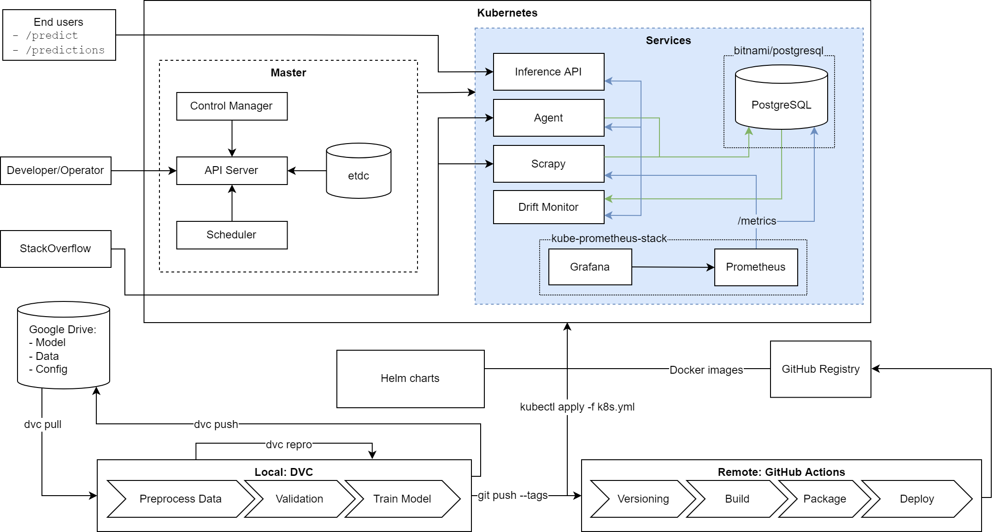

# REMLA 2022 Project

[](https://github.com/JulianBiesheuvel/remla_so/actions/workflows/release.yml)
[](https://github.com/JulianBiesheuvel/remla_so/actions/workflows/pytest.yml)


In this repository we performed release engineering on a [StackOverflow tag prediction project created by @partoftheorigin](https://github.com/partoftheorigin/multilabel-classification-stack-overflow). In addition we extended the project with drift detection and automated data collection.

Note that we mostly used VSCode Live Share to work on the project and thus the commit history is not representative, as all group members contributed to the project.

## Overview



## Setup

### GitHub Actions Secrets

In order to reproduce the GitHub Actions used, the following secret is needed:

- `GDRIVE_CREDENTIALS_DATA` Google service account credentials as documented by [DVC](https://dvc.org/doc/user-guide/setup-google-drive-remote#using-service-accounts)

### Kubernetes & Helm

> To be able to pull the model api image, k8s needs a GitHub Personal Access Token with read package rights. To tell k8s about this token you can use
>
> ```bash
> kubectl create secret docker-registry ghcr-pat --docker-server=ghcr.io --docker-username=<GITHUB_USER> --docker-password=<GITHUB_PAT>
> ```
> Note: this stores your secret in your history, see https://kubernetes.io/docs/tasks/configure-pod-container/pull-image-private-registry/ for other ways of providing the secret to k8s.
>
> Note that this may not be needed anymore as the repository is public now.

To deploy using minikube run

```bash
# set up minikube
minikube start
minikube addons enable ingress

helm repo add prometheus-community https://prometheus-community.github.io/helm-charts
helm repo add bitnami https://charts.bitnami.com/bitnami
helm repo update
helm install promstack prometheus-community/kube-prometheus-stack
kubectl apply -f k8s.yml # defines secrets pg depends on
helm install postgres -f postgres-values.yml bitnami/postgresql

# to make the ingress accessible
minikube tunnel
```

Then access cluster resources using 
```
# connect to pod/svc/... (type)
# kubectl port-forward <type>/<name> from:to
kubectl port-forward svc/promstack-prometheus 9090
```

### Development

For this project, Python 3.9 and poetry (>=1.2.0b2) are needed.

#### Local Installation

```bash
# to install all dependencies, use
poetry install --sync --with dev,pipeline,model-api,scraper,so-agent,main --without=drift-monitor
poetry install --sync --with drift-monitor
```

#### Usage

```bash
poetry shell # activates the environment (alternatively use poetry run before each command)

mllint # run the linters
dvc pull data # pull data
dvc repro # run pipeline
uvicorn lib.service:app --reload # run inference api
```

## Structure

```
 .
├── Dockerfile.drift-monitor
├── Dockerfile.model-api
├── Dockerfile.scraper
├── Dockerfile.so-agent
├── Predict tags on StackOverflow with linear models.ipynb
├── README.md
├── data
│   ├── processed
│   │   ├── preprocessed.csv
│   │   ├── train.joblib
│   │   └── validation.joblib
│   ├── raw
│   │   ├── raw.tsv
│   │   ├── train.tsv
│   │   └── validation.tsv
│   ├── raw.dvc
│   ├── test.tsv
│   ├── text_prepare_tests.tsv
│   ├── train.tsv
│   └── validation.tsv
├── drift_monitor
│   ├── drift_monitor.py
│   └── main.py
├── dvc.lock
├── dvc.yaml
├── k8s.yml
├── lib
│   ├── conf.py
│   ├── model.py
│   ├── preprocess.py
│   └── utils.py
├── model_api
│   └── main.py
├── output
│   ├── BagOfWords.json
│   ├── TFIDF.json
│   ├── data
│   │   ├── anomalies_train.txt
│   │   ├── anomalies_validation.txt
│   │   ├── schema.txt
│   │   ├── stats_train.txt
│   │   ├── stats_validation.txt
│   │   ├── tfdv_test.txt
│   │   ├── tfdv_train.txt
│   │   ├── train.txt
│   │   └── validation.txt
│   └── models
│       ├── BagOfWords.joblib
│       └── TFIDF.joblib
├── pipeline
│   ├── gen_schema.py
│   ├── preprocess.py
│   ├── train.py
│   └── validate.py
├── poetry.lock
├── postgres-values.yml
├── pyproject.toml
├── reports
│   ├── coverage.xml
│   └── tests.xml
├── scraper
│   ├── extensions.py
│   ├── items.py
│   ├── pipelines.py
│   ├── settings.py
│   └── spiders
│       └── spider.py
├── scrapy.cfg
├── so_agent
│   └── main.py
└── tests
```

## Notes

There is a python core module named `code`. Shadowing mostly works as one would expect, but `gunicorn` says no.
Using `joblib`/`pickle` to save an object defined in the same file will mess with the stored path.
Again `gunicorn` and `uvicorn` don't play well with this, hence the training is done in a separate file.

So even the tests don't work with this...
`ImportError: cannot import name '__version__' from 'code' (/usr/lib/python3.8/code.py)`
FYI this is the module messing with the naming [https://docs.python.org/3.9/library/code.html](https://docs.python.org/3.9/library/code.html)

Lessons learned
- python naming & shadowing is shady and established packages (`uvicorn`,`gunicorn`)
- don't use code as your source code directory name if you have to reference it anywhere